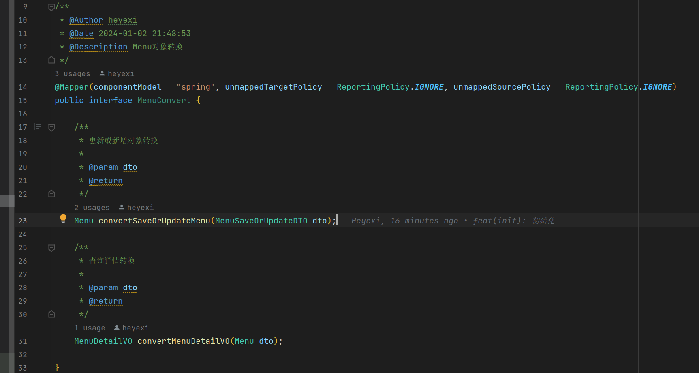

## 项目说明

- zetaHubCodeGenerater是一款实用的代码生成器，能够通过表名一键生成增删改成代码


## 项目特点

- 友好的代码结构及注释，便于阅读及二次开发
- 支持spring boot starter，能很方便集成到第三方项目
- 支持通过配置数据源，快速生成CRUD代码，减少重复工作
- 会生成相应的DTO、VO、Entity、Controller、Service、Mapper、Convert
- 支持第三方Java项目包名修改，修改包名变得简单快速
- 支持基于已经提供的FreeMaker模板文件，进行自定义的二开

> 特别说明：该项目生成的接口默认使用SpringBoot + Mybatis-Plus 的组合，当前你也可以进行定制化二开！

## 本地启动

- 通过git下载源码
- 使用如下用例即可开箱食用，只需要配置数据源，包配置和全局信息即可
```java
/**
 * 代码生成集成测试
 */
@org.junit.jupiter.api.Test
void codeGenerateTest() {
    ZetaHubCodeGenerator zetaHubCodeGenerator = new ZetaHubCodeGenerator();
    GlobalConfig globalConfig = new GlobalConfig();
    PackageConfig packageConfig = new PackageConfig();
    DataSourceConfig dataSourceConfig = new DataSourceConfig();

    // 全局配置
    globalConfig.setTablesName(Arrays.asList("iam_menu")).setAuthor("heyexi")
            .setTablePrefix(Arrays.asList("iam_"))
            .setPrimaryFieldName("id").setDelFiledName("delFlag")
            .setProjectPathModel(2)
            // 使用相对路径
            .setCustomProjectRootPath("zetaHubCodeGenerater");

    // 包配置
    packageConfig.setParentPackage("com.heyexi");
    packageConfig.setModuleName("sample");

    dataSourceConfig.setPassword(pwd);
    dataSourceConfig.setUrl(url);
    dataSourceConfig.setUsername(uname);

    zetaHubCodeGenerator.setGlobalConfig(globalConfig);
    zetaHubCodeGenerator.setPackageConfig(packageConfig);
    zetaHubCodeGenerator.setDataSourceConfig(dataSourceConfig);

    codeGenerateService.generate(zetaHubCodeGenerator);
}
```

## 效果图

##### Controller生成分页查询、新增、更新、查询详情、删除五个接口


##### Convert，使用mapstruct，生成对象转换文件


##### 生成所有接口的DTO和VO对象


##### 生成Entity对象


##### 生成mapper和xml文件


##### 生成Service接口


##### 生成Service实现类

